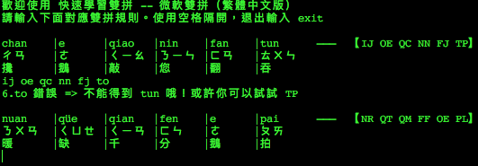
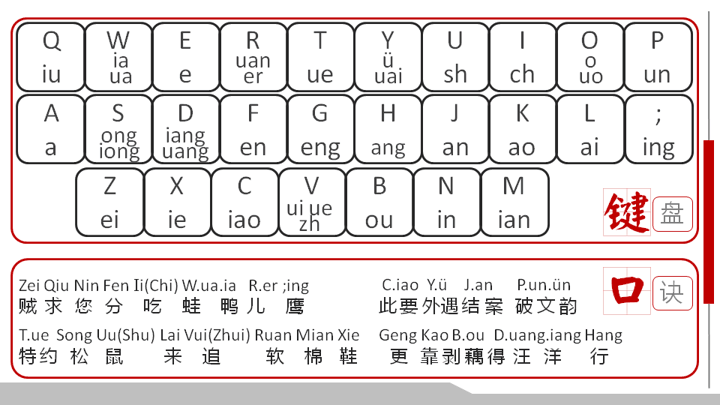

# 幫助你快速學習雙拼 —— 微軟雙拼（繁體中文版）Go 版
從 https://github.com/jsdnhk/shuang_pin_tutorial 移植成 go 版本

### 程序簡介：

一個萌妹子風格的輸入法學習套件，參考新華字典的設定，每次隨機出現出合理的拼音組合。<br>
根據輸出的拼音組合中打出對應的雙拼，每個字用空格隔開，按 Enter 提交，輸入 `exit` 提交或者按下 Ctrl+c 退出練習。

快速學習雙拼 程序畫面：<br>


微軟雙拼鍵盤方案圖：<br>


<br>另外，[參考文件夾][folder_img]中附上：

* [普通話聲韻配合表][pthtable]
* [漢語拼音與通用拼音對照表][shuang_pin_200_words_sample]
* [雙拼鍵盤口訣][shuang_pin_keyboard_quote]
* [速成雙拼需學200字][zhuyin_pinyin_conversion_table]

---

### 執行步驟：

需要先安裝 Go（建議 1.21+）。

安裝與運行：
```bash
# 下載並安裝

# 或者從原始碼編譯
go build ./cmd/shuang_pin_tutorial_go/

```

### 選項：

| 選項 | 說明 | 預設值 |
|------|------|--------|
| `-w num` | 每次顯示的字數 | 6 |
| `-r` | 關閉輸入提示（雙拼按鍵） | 開啟 |
| `-z` | 關閉注音符號顯示 | 開啟 |
| `-c` | 關閉中文詞彙顯示 | 開啟 |

### 範例：

```bash
# 每次顯示 3 個字，關閉所有提示
shuangpin-tutorial -w 3 -r -z -c

# 每次顯示 10 個字，顯示所有提示
shuangpin-tutorial -w 10
```


[folder_img]: ./ref
[pthtable]: ./ref/PTHtable_cuhk.pdf
[shuang_pin_200_words_sample]: ./ref/shuang_pin_200_words_sample.txt
[shuang_pin_keyboard_quote]: ./ref/shuang_pin_keyboard_quote.txt
[zhuyin_pinyin_conversion_table]: ./ref/zhuyin_pinyin_conversion_table.pdf
